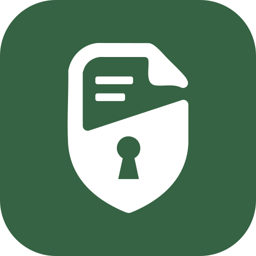

<p align="center"></p>

<h1 align="center">krypta</h1>

<p align="center"><em><b>Forms only you can read.</b></em></p>

<p align="center">Every response is encrypted in the visitor's browser. We store ciphertext. Only you hold the key.</p>

<p align="center"><a href="#getting-started"><b>Getting started</b></a> &nbsp;&middot;&nbsp; <a href="#how-the-encryption-works"><b>How it works</b></a> &nbsp;&middot;&nbsp; <a href="infra/docker/README.md"><b>Deploying</b></a> &nbsp;&middot;&nbsp; <a href="https://buymeacoffee.com/krypta"><b>Support</b></a></p>

<p align="center">  </p>

<p align="center">      </p>

---

krypta is a form builder with the shape you would expect: questions, a share
link, responses in a table. The difference is underneath. Every question, every
answer and every uploaded file is encrypted in the browser before it is sent.
The server stores ciphertext, moves ciphertext, and has no key to open any of
it. Not the operator, not an administrator, not someone holding a database
dump.

**Contents**&nbsp;&nbsp;
[What we can see](#what-we-can-and-cannot-see) &middot;
[Features](#features) &middot;
[Encryption](#how-the-encryption-works) &middot;
[Layout](#repository-layout) &middot;
[Getting started](#getting-started) &middot;
[Checks](#running-the-checks) &middot;
[Deploying](#deploying-to-production) &middot;
[Docs](#documentation)

## What we can and cannot see

This is the whole point of the project, so it is worth stating plainly.

| We can never read this | We can read this, because the server has to act on it |
|---|---|
| Form titles | Who has an account |
| Questions and options | Which account owns which form |
| Answers | When a form was created |
| Uploaded files | How many responses it holds |
| Appearance settings | Whether it is still accepting them |
| The confirmation message | Its close date and response cap |
| | The TOTP secret of anyone who enrols 2FA |
| | An account's plan and subscription status, where the instance bills |

A close date the server cannot read is a close date it cannot enforce, which is
why the right column exists at all.

**Nothing in the right column composes into the left one.** Knowing that an
account owns a form does not help us open it. A form link is
`/f/<form id>#key=<schema key>`, and that key lives in the URL **fragment**,
which browsers never send to a server. It is read out of `window.location.hash`
and used to decrypt in the visitor's own browser. So we can build the link and
fetch what it points at, and what comes back is the ciphertext we already
stored. Responses are further out of reach again: each one is sealed to the
form's public key, and the private half is wrapped under the owner's account
key.

What the right column does give an operator is metadata: that an account
exists, owns some number of forms, and that those forms received some number
of responses at certain times. That is real, and it is the honest cost of a
server being able to enforce a quota or a close date at all.

> [!IMPORTANT]
> Two consequences follow from this and cannot be engineered away.
>
> **No server-side content rules.** Virus scanning an upload, validating that a
> required field was filled, or checking a password's length all need the
> server to look inside. It cannot. Those rules run in the browser and nowhere
> else.
>
> **No administrator-assisted recovery.** Lose both the password and the vault
> recovery code and the data is gone permanently. No one can restore it,
> because no key that could exists anywhere.

## Features

| | |
|---|---|
| **Ten question types** | Short text, long text, multiple choice, checkboxes, dropdown, number, email, date, file upload, and rating (stars or a numbered scale). Plus a required toggle and an optional respondent-written "Other". |
| **Two layouts** | Classic shows a page of questions with section breaks. Focus shows one at a time. Same question types, same rules underneath. |
| **Conditional questions** | Show a question only when an earlier answer says so. Evaluated entirely in the respondent's browser. |
| **Anonymous responses** | No account needed. Open a link, fill it in, and the answers are sealed to the form's public key. |
| **Encrypted uploads** | Any S3-compatible object store holds them, and cannot read them. |
| **Drafts on the device** | Closing a tab does not throw away half-finished work. |
| **Collaboration** | Invite Editors and Viewers. Access is granted by sealing the form keys to their account key, so the server provisions it without being able to use it. |
| **Response limits** | A close date, a response cap, and a custom confirmation message. |
| **Notifications** | Email when responses arrive, carrying a count and a link, never a title, because the server cannot read one. |
| **Accounts** | Email and password with mandatory verification, TOTP, passkeys, and vault recovery. |
| **Administration** | Registration toggle, quotas, rate limits, account lifecycle, health view. An admin gains no ability to read anything. |
| **Optional billing** | Stripe, for a hosted instance. Without Stripe configuration, no billing route is ever mounted. |
| **Self-hostable** | One compose file, one env file, Traefik in front. |

## How the encryption works

A password never reaches the server and never wraps anything directly. A random
32-byte **account key**, generated in the browser, sits in the middle:

```
password       ->  Argon2id  ->  password unlock key  ->  wraps  ->  account key
recovery code  ->  Argon2id  ->  recovery unlock key  ->  wraps  ->  account key
passkey PRF    ->  BLAKE2b   ->  passkey unlock key   ->  wraps  ->  account key

                                       account key  ->  wraps every form key you own
```

Three properties fall out of that shape:

1. **The server receives verifiers, not secrets.** The browser sends a hash of
   the unlock key, and the API hashes that again with Argon2id before storing
   it. A logged request, a compromised proxy or a database dump yields nothing
   that opens a wrapper.
2. **Adding a way to unlock is adding a wrapper**, not re-encrypting anything.
   Passkeys shipped as one more wrapper over the same account key. Nothing
   below it moved.
3. **Recovery replaces the password without touching the data.** Every form
   key, collaborator grant and sealed file stays valid, because none of them
   was ever tied to the password.

Responses are sealed to a per-form public key with a hybrid of ML-KEM-768 and
X25519, so a response recorded today is not readable by a future quantum
computer that breaks X25519 alone. Everything symmetric uses libsodium.

## Repository layout

```
apps/web         Next.js client. All encryption and decryption happens here.
apps/api         Rust and Axum service. Stores and moves ciphertext only.
packages/crypto  Shared key derivation, wrapping and sealing helpers.
infra/docker     Dev, smoke and production stacks, plus the backup script.
scripts/ci.sh    The single definition of what passing means.
```

## Getting started

This section sets up a development instance on your own machine, and nothing
here is meant to face the internet: it serves over plain HTTP on localhost,
catches every email locally, and keeps its object store in a container. To run
an instance other people use, see
[Deploying to production](#deploying-to-production) instead.

You do not need a cloud account of any kind to run krypta locally. The dev
stack brings its own object store and its own mail catcher.

### Prerequisites

| Tool | Why |
|---|---|
| [Bun](https://bun.sh) | Runs the web app and the workspace. |
| [Rust](https://rustup.rs) (stable) | Builds the API. |
| Docker with the compose plugin | Runs Postgres, Redis, Mailpit and Garage. |

### 1. Install dependencies

```bash
git clone <your-clone-url> krypta
cd krypta
bun install
```

### 2. Start the backing services

```bash
docker compose -f infra/docker/docker-compose.dev.yml up -d
```

| Service | Where | What it is for |
|---|---|---|
| Postgres | `localhost:5433` | Ciphertext and metadata. |
| Redis | `localhost:6379` | Sessions, rate limits, pending signups. |
| Garage | `localhost:3900` | S3-compatible store for encrypted attachments. |
| Mailpit | `localhost:8025` | Catches every email. Nothing leaves your machine. |

### 3. Bootstrap the object store, first time only

<details>
<summary>Garage needs a one-time layout, a bucket and a key pair (six commands)</summary>

<br>

Run these from `infra/docker`:

```bash
docker compose -f docker-compose.dev.yml exec garage /garage node id
# copy the node id it prints into the next command
docker compose -f docker-compose.dev.yml exec garage /garage layout assign -z dc1 -c 50G <node-id>
docker compose -f docker-compose.dev.yml exec garage /garage layout apply --version 1
docker compose -f docker-compose.dev.yml exec garage /garage bucket create krypta
docker compose -f docker-compose.dev.yml exec garage /garage key create krypta-api
docker compose -f docker-compose.dev.yml exec garage /garage bucket allow --read --write --owner krypta --key krypta-api
```

The `key create` step prints an access key and a secret. Keep them for the next
step.

</details>

### 4. Configure and run the API

```bash
cd apps/api
cp .env.example .env
```

Paste the two Garage values into `S3_ACCESS_KEY` and `S3_SECRET_KEY`.
Everything else in that file already points at the dev services. Then:

```bash
cargo run
```

The API listens on `http://localhost:8080` and runs its migrations
automatically on start. The first build takes a few minutes; later ones are
fast.

### 5. Run the web app

In a second terminal:

```bash
cd apps/web
bun run dev
```

Open **http://localhost:3000**.

### 6. Create your account

Sign up with any address. The verification code is not emailed anywhere real:
open Mailpit at **http://localhost:8025** and read it there.

> [!TIP]
> To give yourself instance administrator rights, set
> `KRYPTA_INITIAL_ADMIN_EMAIL` in `apps/api/.env` to that address **before** you
> register, then enrol TOTP and log in again. `/admin` opens once the second
> factor has been used.

## Running the checks

`scripts/ci.sh` is the single definition of what passing means, and the GitHub
workflow calls it rather than listing its own steps, so the two cannot drift.

```bash
bun run ci:static       # formatting, clippy, types, lint, unit tests, audits, build, needs the stack up
bun run ci:integration  # API integration suites and Playwright, needs the stack up
bun run ci:images       # build both Docker images and boot each one, needs Docker
bun run ci              # static and integration
```

Per-service commands, for a faster loop:

```bash
cd apps/api && cargo test && cargo fmt && cargo clippy -- -D warnings
cd apps/web && bun run test:unit && bun run lint && bun run typecheck && bun run build
cd apps/web && bunx playwright install && bun run test:e2e
```

> [!WARNING]
> The API's rate limits are real in development too, and roughly three full
> integration runs back to back exhaust them. The symptom is misleading:
> registration returns 429, so no session cookie is set, and the test fails at a
> later step instead. Clear the counters before concluding anything is broken.
>
> ```bash
> docker compose -f infra/docker/docker-compose.dev.yml exec redis \
>   redis-cli --scan --pattern 'ratelimit:*' | xargs -r \
>   docker compose -f infra/docker/docker-compose.dev.yml exec redis redis-cli DEL
> ```

## Running the whole thing in Docker

To build and start every service at once, including the API and web app:

```bash
docker compose -f infra/docker/docker-compose.yml up -d
```

This is a local smoke stack for checking that the images build and boot
together. It is slower to iterate on than the commands above, its mail
terminates in a container rather than a real relay, and it must not be used in
production. Do not run it alongside the dev stack: they bind the same host
ports.

## Deploying to production

Running an instance other people use takes one Linux server, one domain, an
S3-compatible bucket and an SMTP provider. Traefik terminates TLS with Let's
Encrypt and is the only thing listening on the internet; on a server managed by
Dokploy, `docker-compose.dokploy.yml` hands that job to Dokploy's own proxy
instead. You can pull published images or build from source, and building stays
supported deliberately: anyone relying on the encryption happening in their
browser should be able to run code they have read.

**[`infra/docker/README.md`](infra/docker/README.md) is the guide**, written
for an operator rather than a developer. It covers the server and DNS, the
hostname choices that are permanent once passkeys are enrolled, object storage,
email, the first administrator, encrypted off-site backups, uptime monitoring,
upgrades, and every setting with what it does.

## Documentation

| Where | What it covers |
|---|---|
| This file | What krypta is, and how to run it locally. |
| [`infra/docker/README.md`](infra/docker/README.md) | Deploying and operating a production instance. |
| [`apps/web/README.md`](apps/web/README.md) | The client: fonts, form dark mode, its own checks. |
| [`apps/api/README.md`](apps/api/README.md) | The service: routes, migrations, test suites. |
| [`SECURITY.md`](SECURITY.md) | The guarantee, its limits, and how to report a vulnerability. |

## Supporting krypta

krypta is free, open source, and built so that nobody running it can read
what it holds. If it is useful to you, you can support its development on
[Buy Me a Coffee](https://buymeacoffee.com/krypta).

## License

[GNU AGPL v3 or later](LICENSE).

Copyleft is a deliberate choice here rather than a default. krypta's claim is
that the encryption happens in your browser and the server cannot read
anything, and the only way to check that claim is to read the code. A
permissive licence would let someone take krypta, add a line that quietly
sends the key somewhere, and run it as a service with nobody able to tell.
Section 13 of the AGPL is the clause that closes that: run a modified version
over a network, publish the modification.

So the licence is not only about the project, it is part of what makes the
guarantee checkable.
